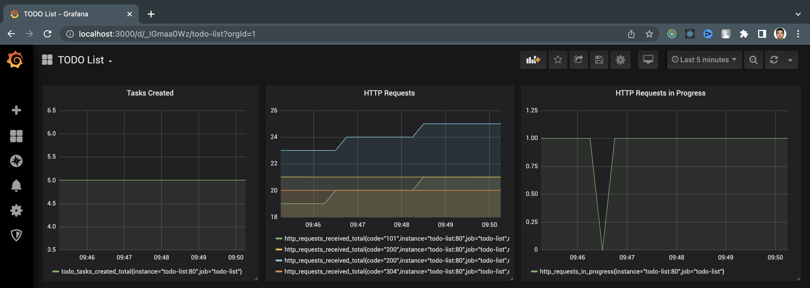

# Prometheus & Grafana Tutorial

The `to-do` app for this lab already has Prometheus support built in. You can check it by running:

- Then browse to http://localhost:8050 and enter some tasks to do.
- Browse to http://localhost:8050/metrics and you'll see the Prometheus metrics.

```
docker container dun -d -p 8050:80 diamol/ch09-todo-list
```

In practise, when building the app, you needs to develop the Promethus metrics logging, for example [Python](https://www.youtube.com/watch?v=HzEiRwJP6ag) app, along with the source code of the app before dockerizing the image.

## The goal of this tutorial

- Write a **Docker Compose file** that you can use to run the app, which also starts a custom Prometheus container and a custom Grafana container.
- The **Prometheus container** should already be configured to scrape metrics from the to-do list app.
- The **Grafana container** should be configured with a dashboard to show three key metrics from the app: number of tasks created, total number of HTTP requests processed, and number of HTTP requests currently being processed.

## The custom Prometheus image

Prometheus just needs to be configured to scrape the `todo-list` application.

You can see the scrape config in my [prometheus.yml](./prometheus/prometheus.yml):

```
  - job_name: "todo-list"
    metrics_path: /metrics
    static_configs:
      - targets: ["todo-list"]
```

And there's a simple [Dockerfile](./prometheus/Dockerfile) to package that config file into a Docker image from the base prometheus Docker image.

- The building of the newly configured prometheus will be taken care via [docker-compose.yml](./docker-compose.yml) in `prometheus` services

```Dockerfile
FROM diamol/prometheus:2.13.1

# Replace prometheus.yml from base prometheus image with the configured setting for scraping `todo-list` application
COPY prometheus.yml /etc/prometheus/prometheus.yml
```

## The custom Grafana image

#### `dashboard.json` creation

- I built the dashboard by running a Grafana container when I had the Prometheus and todo-list containers running. I added three basic panels to give me this:



The **PromQL** queries are all straightforward - there's no need for aggregation or filtering:

- `todo_tasks_created_total`
- `http_requests_received_total`
- `http_requests_in_progress`

Then I exported the JSON and saved it to [dashboard.json](./grafana/dashboard.json).

#### Dockerize the custom Grafana image

The [Dockerfile](./grafana/Dockerfile) for the custom Grafana image with the `dashboard.json` (also with the [dashboard-provider.yaml](./grafana/dashboard-provider.yaml)) and Prometheus data source [datasource-prometheus.yaml](./grafana/dashboard-provider.yaml).

## Running the app with custom Prometheus and Grafana images

This [docker-compose.yml](docker-compose.yml) manifest starts the app with Prometheus and Grafana image.

Run it with:

```
docker-compose up -d --build
```

Then browse to http://localhost:8050 for the `todo-list` app GUI, add some tasks and check the Grafana dashboard at http://localhost:3000.
