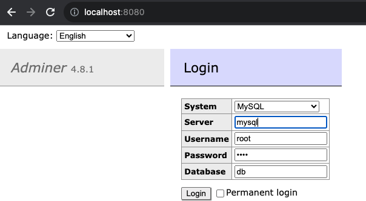

# Python - Postgres - MySQL

## Adminer

Adminer is a tool for managing content in databases. It natively supports MySQL, MariaDB, PostgreSQL, SQLite, MS SQL, Oracle, Elasticsearch and MongoDB.

<p align="center"></p>

```
# server = service name, in this case is "mysql"
DB_USER=root
DB_PASSWORD=root
DB_PORT=3306
DB_NAME=db

```

## Network in Docker Compose

- Compose sets up a single network for your app. Each container for a service joins the default network and is both reachable by other containers on that network, and discoverable by them at a hostname identical to the container name

```yaml
services:
  web:
    build: .
    ports:
      - "8000:8000"
  db:
    image: postgres
    ports:
      - "8001:5432"
```

When you run `docker compose up`, the following happens:

1. A network called `myapp_default` is created.
2. A container is created using `web`’s configuration. It joins the network `myapp_default` under the name `web`.
3. A container is created using `db`’s configuration. It joins the network `myapp_default` under the name `db`.

Each container can now look up the hostname `web` or `db` and get back the appropriate container’s IP address.

- For example, `web`’s application code could connect to the URL `postgres://db:5432` and start using the Postgres database.

### Distinction between `HOST_PORT` and `CONTAINER_PORT`

- For `db`, the `HOST_PORT` is `8001` and the container port is `5432` (postgres default). Networked service-to-service communication uses the `CONTAINER_PORT`. When `HOST_PORT` is defined, the service is accessible outside the swarm as well.

- Within the `web` container, your connection string to `db` would look like `postgres://db:5432`

- From the host machine, the connection string would look like `postgres://{DOCKER_IP}:8001`
  - For example `postgres://localhost:8001` if your container is running locally.
