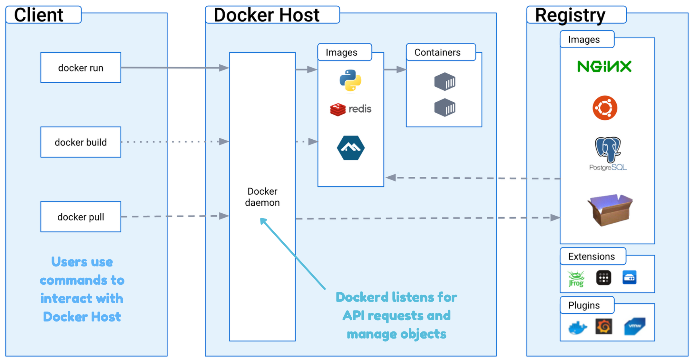

# Docker Architecture

## Introduction

- Docker uses a **client-server** architecture.
- Docker **client**: talks to the Docker **daemon**, which does the heavy lifting of building, running, and distributing your Docker containers.
  - Another Docker client is Docker **Compose**, that lets you work with applications consisting of a set of containers.
- The Docker client and daemon can run on the same system, or you can connect a Docker client to a remote Docker daemon.
- The Docker client and daemon communicate using a REST API, over **UNIX sockets** or a network interface.

### Docker Daemon `dockerd`

- The Docker daemon (`dockerd`) listens for Docker API requests and manages Docker objects such as images, containers, networks, and volumes.
- A daemon can also communicate with other daemons to manage Docker services.

#### Daemon’s socket `/var/run/docker.sock`

- Reference: [var/run/docker.sock](https://www.educative.io/answers/var-run-dockersock)
- By default, a Docker daemon on a Docker platform listens on the `/var/run/docker.sock` Unix socket.
- It is also a tool used to communicate with the Docker daemon from within a container.
  - Note: containers need to **bind mount** the `/var/run/docker.sock` file.

#### Bind mounting the daemon’s socket into the container

- Mounting the Docker daemon socket gives the control of the daemon to the container.
- Note: this process should only be used with trusted containers when necessary.
  - For example: Jenkins in container can bind mount with the daemon's socket, so that the Jenkins container can build the docker images

### Docker Client

#### `docker`

- The Docker client (`docker`) is the primary way that many Docker users interact with Docker.
- When you use commands such as `docker run`, the client sends these commands to `dockerd`, which carries them out.
- The `docker` command uses the Docker API.
- Note: The Docker client can communicate with more than one daemon.

#### `docker compose`

### Docker Desktop

- Docker Desktop is an easy-to-install application
- Docker Desktop includes the Docker daemon (`dockerd`), the Docker client (`docker`), Docker Compose, Docker Content Trust, Kubernetes, and Credential Helper.
